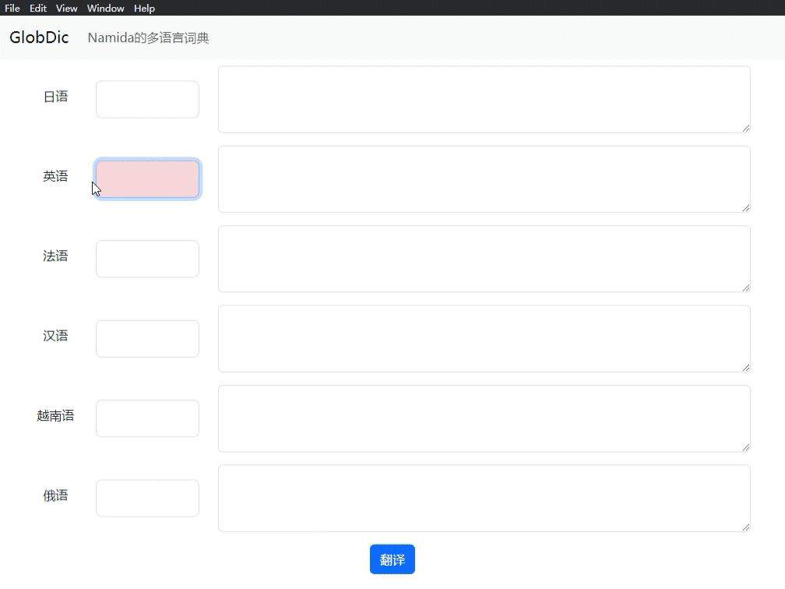

# GlobDict

一个基于 ChatGPT 的多语言词典

A multilingual dictionary based on ChatGPT

[English Readme here](./Readme_en.md)



## 安装方法

下载 release 里的软件

去 [OpenAI 官网](https://platform.openai.com/account/api-keys)申请 API Key

注意，你的OpenAI的API账户里应有余额。即此软件不是免费的，但不是给我钱而是给OpenAI。

添加`OPENAI_API_KEY`到环境变量

### Windows

```cmd
setx OPENAI_API_KEY "your-api-key-here"
```

### MacOS

编辑 `~/.bash_profile` 或者 `~/.zshrc` 文件

在文件的最下方新增一行

```zsh
export OPENAI_API_KEY='your-api-key-here'
```

输入命令`source ~/.bash_profile` 或 `source ~/.zshrc`来更新
