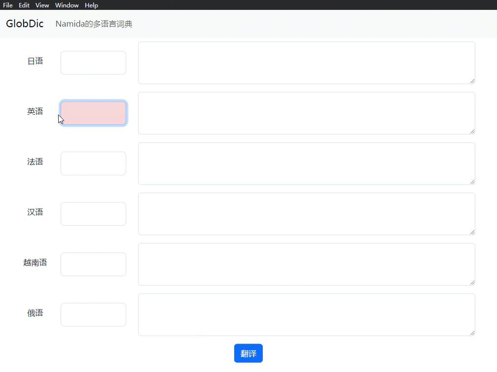

**English** | [中文](README.zh-CN.md)

# GlobDict

A multilingual dictionary powered by ChatGPT.

Type a word in one language and GlobDict translates it into all the other supported languages **at once**, complete with each word's **etymology and pronunciation**. The interface language itself is switchable, so you can use the app in whichever language you're most comfortable with.



## Features

- **Translate into many languages at once** — enter one word and get results across every supported language simultaneously.
- **More than a translation** — each result includes a short note on the word's origin and how it's pronounced.
- **Switchable UI language** — the whole interface adapts to the language you pick.
- **Cross-platform desktop app** — built with Electron (Windows / macOS / Linux).

Supported languages: Japanese, English, French, Chinese, Vietnamese and Russian.

## Installation

1. Download the app from the [releases](https://github.com/Snownamida/GlobDict/releases).
2. Apply for an API key at [OpenAI's official website](https://platform.openai.com/account/api-keys).

   Please note that your OpenAI API account should have sufficient balance. This software is not free to run — but the payment goes to OpenAI, not to me.
3. Add your key as an `OPENAI_API_KEY` environment variable (see below).

### Windows

```cmd
setx OPENAI_API_KEY "your-api-key-here"
```

### macOS

Edit your `~/.bash_profile` or `~/.zshrc` file and add a new line at the bottom:

```zsh
export OPENAI_API_KEY='your-api-key-here'
```

Then run `source ~/.bash_profile` or `source ~/.zshrc` to apply it.

## Development

Built with Electron, Bootstrap and the OpenAI SDK.

```bash
npm install
npm start          # launch the app (electron-forge)
npm run make       # build distributable packages
```

## License

[MIT](./LICENSE.txt) © Snownamida
