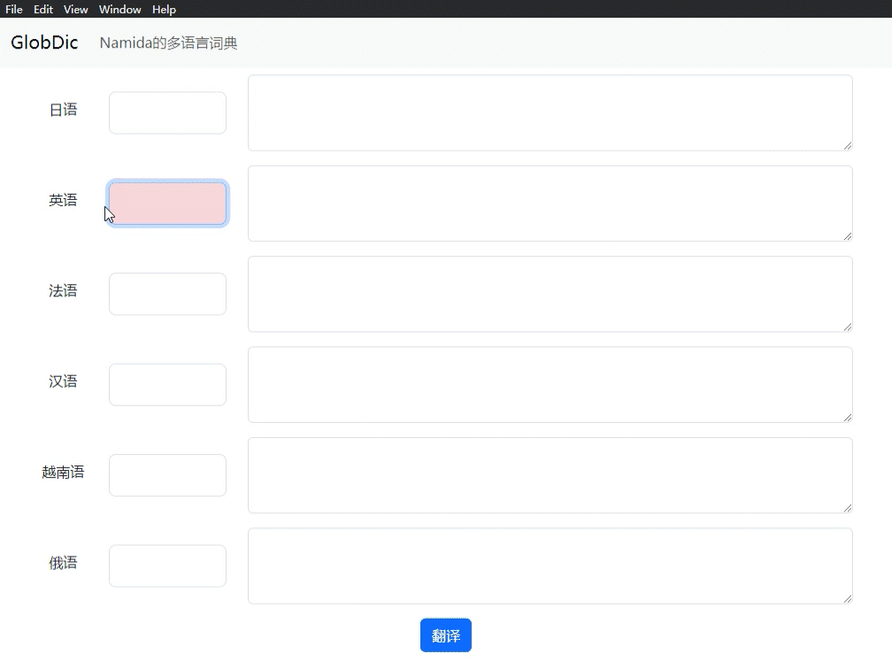

# GlobDict

A multilingual dictionary based on ChatGPT



## Installation

Download the software from the releases

Apply for an API Key at [OpenAI's official website](https://platform.openai.com/account/api-keys)

Please note that your OpenAI API account should have sufficient balance. This software is not free, and the payment goes to OpenAI, not to me.

Add `OPENAI_API_KEY` to the environment variables

### Windows

```cmd
setx OPENAI_API_KEY "your-api-key-here"
```

### MacOS

Edit `~/.bash_profile` or `~/.zshrc` file

Add a new line at the bottom of the file

```zsh
export OPENAI_API_KEY='your-api-key-here'
```

Run the command `source ~/.bash_profile` or `source ~/.zshrc` to update.
